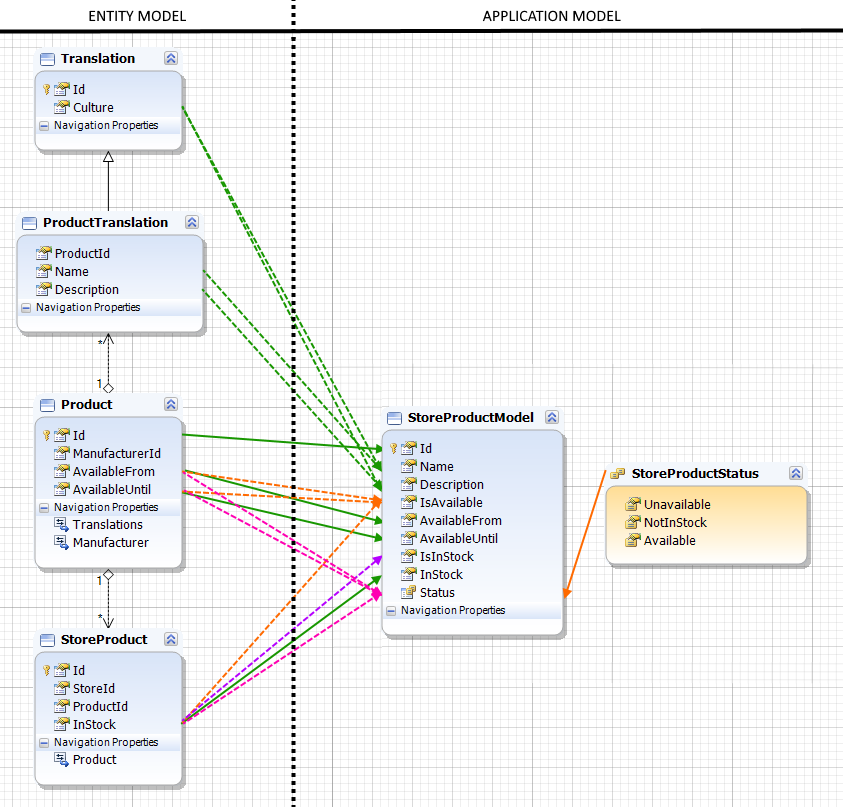

# Example.Console.QueryMultilingual

This example demonstrates how to retrieve a list of entities from the database that has a multilingual schema. 
We take products as an example, where each product has a different name and description for each language.
To the end-user we only present one (his) language, so we need to flatten the multilingual entity model to a (language specific) application model.
This is what the mapping looks like:

`AutoMapper` uses convention based mapping so this simplifies things for us.
//TODO : For instance the solid green lines indicate directly mapped properties from `StoreProduct` to `StoreProductModel`. 
These are handled by AutoMapper by convention.

Happy coding!

